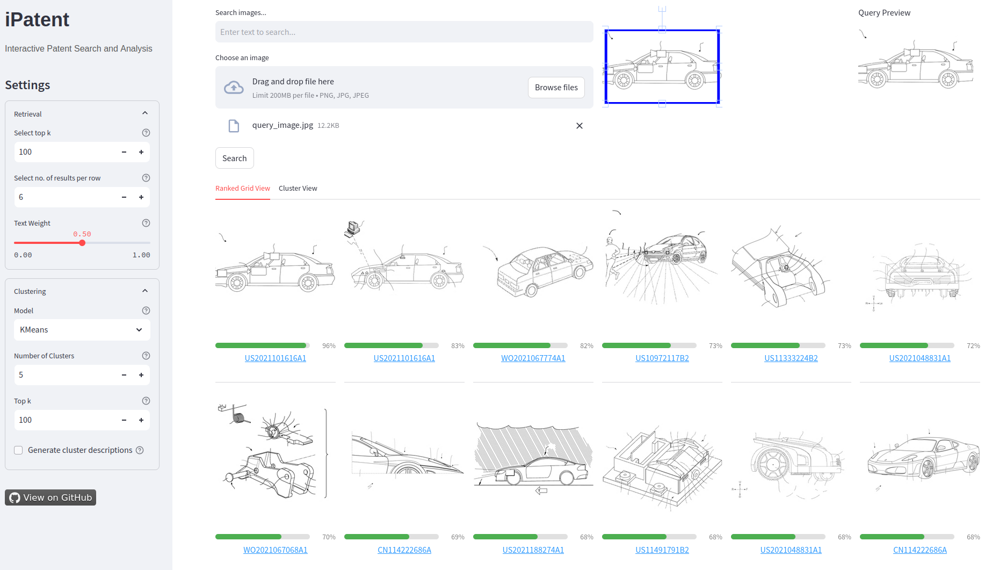

# iPatent - Interactive Patent Search and Analysis

## Overview

iPatent is an open-source, interactive prototype designed to demonstrate web-based multimodal patent image retrieval and analysis. As a proof-of-concept application, it aims to assist patent examiners and applicants with tasks such as **Prior Art Search**, **Cross-Domain and Multimodal Search**, **Infringement Detection**, and **Freedom-to-Operate Analysis**. The demo supports three retrieval modes: *image-to-image*, *text-to-image*, and *text-conditioned image-to-image search*.

## About the project

iPatent is part of the project "ViP@Scale: Visual and multimodal patent search at scale" funded by the Academic Research Programme of the European Patent Office.